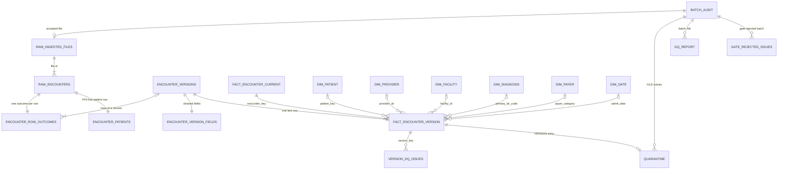

# Architecture

Two labels are used throughout:

- **Current:** what this repository implements and tests, a Python and DuckDB
  pipeline run in Docker with `docker compose up --build`.
- **Proposed:** the production design on Azure Databricks. None of it is
  implemented here.

[README.md](README.md) shows the pipeline flow, the PHI boundary and the six
example queries. [DECISIONS.md](DECISIONS.md) holds every detailed rule and
its reason; this document summarises them.

## 1. Data model (current)

One DuckDB database with four schemas: `raw` (rows as delivered; the only
layer with PHI), `clean` (history, cleaned fields, PHI-free patient attributes,
version DQ issues), `mart` (dimensions and facts) and `ops` (audit,
quarantine, DQ report).



### Table catalogue

Everything except `raw.*`, the `clean.encounter_current` view and
`ops.gate_rejected_issues` is exported to `./output` as CSV.

| Table | Layer | Grain | Key | Notes |
| --- | --- | --- | --- | --- |
| `raw.encounters` | raw (PHI) | accepted delivered row | `batch_id, file_name, source_row_number` | values as delivered |
| `raw.ingested_files` | raw | accepted file | `batch_id, file_name` | schema version, SHA-256; no PHI |
| `ops.batch_audit` | ops | file of every batch | `batch_id, file_name` | status, reasons, Task 4 counts |
| `clean.encounter_row_outcomes` | clean | raw row | `batch_id, file_name, source_row_number` | one outcome per row |
| `clean.encounter_versions` | clean | version | `version_key` | insert-only; first-seen lineage |
| `clean.encounter_current` | clean (view) | encounter | `encounter_key` | latest version |
| `clean.encounter_version_fields` | clean | version | `version_key` | Task 2 fields: source value, cleaned value, reason |
| `clean.encounter_patients` | clean | raw row | `batch_id, file_name, source_row_number` | `patient_key`, `sex`, `age_band`, `zip3` |
| `mart.fact_encounter_version` | mart | version | `version_key` | keys to every dimension; lineage |
| `mart.fact_encounter_current` | mart | encounter | `encounter_key` | current version, `version_count` |
| `mart.dim_patient` | mart | patient | `patient_key` | link status, latest `sex`, `zip3` |
| `mart.dim_provider` | mart | NPI × unchanged roster stretch | `provider_sk` | SCD2 |
| `mart.dim_facility` | mart | facility | `facility_id` | facility master |
| `mart.dim_diagnosis` | mart | ICD-10 code | `icd10_code` | reference plus `in_reference = false` codes |
| `mart.dim_payer` | mart | payer category | `payer_category` | 6 categories |
| `mart.dim_date` | mart | day | `date_key` | calendar years of the data |
| `clean.version_dq_issues` | clean | failed version check | `version_key, check_code` | ERROR or WARNING |
| `ops.quarantine` | ops | rejected file, row or ERROR version | `batch_id, file_name, source_row_number, quarantine_level` (order) | FILE, ROW, VERSION levels |
| `ops.dq_report` | ops | check per batch and file | `batch_id, file_name, check_code` | counts and status |
| `ops.gate_rejected_issues` | ops | failing check per row of a gate-rejected batch | `batch_id, file_name, source_row_number, check_code` | insert-only |

Facts join dimensions only through these keys and read no raw table. Every
nullable fact value has a `<column>_reason`, set whenever it is NULL.

### Lineage
A fact row's `source_batch_id`, `source_file_name` and `source_row_number`
point to the row that supplied its version (the first arrival). They join
`ops.batch_audit` for the file's validation outcome (query 3) and, with
restricted access, `raw.encounters` and `raw.ingested_files`. Rows that
supplied no version (duplicates, stale and quarantined rows) each have an
outcome in `clean.encounter_row_outcomes`.

### Invalid, quarantined and unresolved records
- **Invalid value:** NULL with a reason code; the source value stays in
  `clean.encounter_version_fields`. Nothing is guessed.
- **Version issue:** a row in `clean.version_dq_issues`. A WARNING stays in
  analytics. An ERROR version stays in history, and as current when latest,
  but analytics exclude it. There are two ERROR version checks:
  - an unresolved facility, because the brief sends unresolved facilities to
    quarantine;
  - an unusable admit date. This is a design judgment, not a rule the brief
    states: the reporting month, the point-in-time provider, the age band,
    the length of stay and the Task 7 filter all depend on it.
- **Row that cannot be placed in version order:** outcome QUARANTINED.
- **Rejected batch:** only reporting rows (`ops.batch_audit`, `ops.dq_report`,
  `ops.quarantine`, `ops.gate_rejected_issues`); no modeled table changes.
- `ops.quarantine` lists all of these with reason codes and lineage
  (query 6). Severities: DECISIONS.md, Task 6.

### Payer: a category dimension
`mart.dim_payer` has one row per `payer_category`. This is the brief's
"justified alternative" to a payer-entity dimension. The data pack has no
payer master, and payer names arrive as source-specific spellings (`UHC` and
`UnitedHealthcare`), so a dimension keyed on the delivered name would split one
payer into several members. The brief defines the category as the analytical
attribute, and the delivered name is kept as `payer_name_raw` in
`clean.encounter_version_fields`. A business payer master would turn this
into a payer-entity dimension with the category as an attribute.

## 2. History, current state and as-of (current)

- **Keys.** Encounter = `(source_system, source_record_id)`; version = the
  encounter plus `last_updated_ts` as a UTC instant. `encounter_key` and
  `version_key` are SHA-256 over canonical JSON, so the same input always gives
  the same key.
- **One outcome per raw row:** NEW_ENCOUNTER, NEW_VERSION, DUPLICATE, STALE or
  QUARANTINED, judged against the history held at the end of the previous
  batch and earlier rows of the same batch. Rules: DECISIONS.md, Task 4.
- **History is insert-only.** A version's lineage is its first arrival. An
  older row never overwrites the held current version; a never-held older
  version is kept but never becomes current.
- **Current state is derived.** The `clean.encounter_current` view and
  `mart.fact_encounter_current` take the latest timestamp, so a late, older
  version updates nothing already written. A newest version with a Task 6
  ERROR stays current and is excluded from analytics, with no fallback.
- **Late arrivals are ordinary versions;** monthly totals group the current
  state by `admit_date`, so past months change.
- **As-of reporting** reads history: the current version as of batch N is the
  latest with `first_seen_batch_id <= N` (query 5). `test_incremental_parity.py`
  checks that the as-of-batch_002 state, read from the final history, equals
  what batch_002 left as current.

## 3. Provider SCD2 and point-in-time joins (current)

- `mart.dim_provider` is built from the roster snapshots. A snapshot holds
  from its `as_of_date` to the next one; a new row starts when any roster
  attribute changes or an NPI reappears. Rows from the earliest snapshot are
  valid from `0001-01-01`; `valid_to` is exclusive.
- Each version's `provider_sk` is resolved on its `admit_date`
  (`valid_from <= admit_date < valid_to`) and read by query 4 and the export.
- No match means no provider, never the latest snapshot; `provider_sk_reason`
  says why.

## 4. Local implementation (current)

Python 3.11 and DuckDB in one Docker container; the raw database lives on a
tmpfs and is discarded after each run.

**Per batch,** in `batch_id` order: manifest, SHA-256, CSV, schema contract
and record counts are checked in memory; a failure writes only REJECTED audit
rows. A batch that passes is written in **one DuckDB transaction**:

1. raw rows and file records;
2. the history step: row outcomes and new versions;
3. the new versions' cleaned fields (`clean.encounter_version_fields`);
4. reconciliation of the Task 4 counts; a mismatch rolls back and the run
   exits 1;
5. the publish gate; a failure rolls back, and a second small transaction
   records the batch as REJECTED (`DQ_GATE_FAILED`) with its failing rows;
6. the ACCEPTED audit rows, written last.

**Per run,** after all batches, `clean.encounter_patients` is rebuilt (linkage
spans every batch), then the mart and DQ tables in one transaction, then the
CSVs. Only the history step is batch-sized; the rebuilds depart from "each
batch updates only the records it touches" (DECISIONS.md, Task 4), and
production replaces them with `MERGE`s.

**Python classifier.** `encounter_history.classify_batch` is a pure function;
SQL loads only the touched encounters' history. It is unit-tested, including a
permutation test, and reuses the tested timestamp parser. It runs row by row:
fine for at most about 2,900 rows per batch, not for production volumes.

**Existing parity test.** `tests/test_incremental_parity.py` compares
batch-by-batch loading with a one-shot run, a rerun and rebuilds from raw;
everything is identical apart from `ingested_at`, `start_time` and `end_time`.

## 5. Production design on Azure Databricks (PROPOSED)

Nothing in this section is implemented. Snowflake would be an equivalent
alternative, with external stages or Snowpipe, streams and tasks, and the same
`MERGE` design.

**Landing and ingestion.** Each weekly batch lands in its own ADLS Gen2
folder, `landing/batch_NNN/`: one CSV per source plus `manifest.json`, written
last under the data contract (section 7). Sources cannot change a delivered
batch; the pipeline identity only reads it. Validation is the current Task 1
logic, run before anything is written.

**Layer design:** separately permissioned Unity Catalog catalogs.

| Layer | Holds | Current equivalent |
| --- | --- | --- |
| Bronze (restricted) | raw rows with lineage; file records | `raw` |
| Silver | history, outcomes, cleaned fields, PHI-free patient attributes, DQ issues, `patient_key` crosswalk | `clean` |
| Gold | dimensions, facts, the required export | `mart` |
| Ops | audit, quarantine, DQ report, gate rejections | `ops` |

**Ordered upserts.**
- One batch at a time in `batch_id` order: the job allows one concurrent run,
  and a batch stays pending until its audit rows exist.
- Stage in bronze with UTC timestamps and keys, then classify in one
  set-based query: `row_number() OVER (PARTITION BY version_key ORDER BY
  file_name, source_row_number)` finds first arrivals, and a `CASE` applies the
  current rules. The fingerprint guard reads PHI, so it runs in bronze.
- New versions go in with an insert-only `MERGE`; a replayed batch inserts
  nothing:

  ```sql
  MERGE INTO encounter_versions AS t USING batch_new_versions AS s
    ON t.version_key = s.version_key
  WHEN NOT MATCHED THEN INSERT *;
  ```

- Gold is updated with `MERGE`s over the touched `encounter_key`s, with a
  persistent `patient_key` crosswalk, instead of full rebuilds.
- **Atomicity:** the design does not depend on multi-table transactions.
  Every step is an idempotent `MERGE` and the audit rows are written last as
  the completion marker, so a batch without them is reprocessed without
  duplicates. Multi-table transaction support can be added if confirmed at
  build time.
- **Parity (production proposal):** a new test would run the local Python
  classifier, kept as the reference, and the SQL classification on the same
  batches and compare outcomes, versions and current state row for row. This
  is separate from the existing `test_incremental_parity.py`.

**Schema evolution policy.** Headers must exactly match a registered
contract version, as in `config/schema_contracts.json`; bronze never evolves
from a delivered file. A known change, like Athena's batch_003 layout, is a
reviewed contract change registered before delivery: renames map by name, and
a new column is NULL for versions without it. An unknown change rejects the
batch (`UNKNOWN_SCHEMA_CHANGE`) and alerts the source team.

**Orchestration.** A Databricks Workflows job with a file-arrival trigger on
the landing location runs validate and load, history and gate, silver and gold
updates, then DQ and exports. One concurrent run keeps batches in order.
Azure Data Factory can trigger the same job where landing is already managed
there. Only system failures are retried; a rejection is a data outcome.

**Backfill and reprocessing.** Bronze is immutable, so derived layers are
rebuilt by replaying accepted batches in order through the same per-batch
step, as `--rebuild-derived` does today, for example after a reference, alias
or rule change. A published batch that new rules would reject stops the
replay for a decision; published data is never silently withdrawn. A rejected
batch is final; a corrected redelivery uses a new `batch_id`. Late encounters
need no backfill.

**SLAs: proposed targets, not measured performance.**
- A valid weekly batch is in gold within 4 hours of its manifest arriving.
- The source team and data owner hear of a rejection within 1 hour.
- On-call acknowledges a failed run within 1 business hour; the next run
  resumes at the first pending batch.

**Monitoring and alerting.** The signals already exist: `ops.batch_audit`
(status, counts, reconciliation, timings), `ops.dq_report` (every check, and
the gate's observed share against its threshold), `ops.quarantine` and PHI-free
JSON logs. They feed a dashboard with the job run history.
- A failed run (exit 1 locally), including a reconciliation or invariant
  failure, pages on-call.
- A rejected batch raises a ticket for the source team and data owner, not a
  page.
- A published batch whose `PUBLISH_GATE` row now shows FAIL alerts the data
  owner.

**Runbook: a failed batch.**
1. Decide: a REJECTED batch is a data outcome; a failed run is a system
   failure.
2. Validation rejection: read the reason codes in `ops.batch_audit` and the
   FILE entries in `ops.quarantine` (batch, file and record numbers, no
   values), then ask the source team for a redelivery under a new `batch_id`.
3. Gate rejection: read `ops.gate_rejected_issues`. A source problem needs a
   redelivery; a reference gap, such as a missing facility alias, needs a
   reviewed config change and reprocessing. Never change the threshold ad hoc.
4. System failure: no partial state remains; fix and rerun, and pending
   batches resume in order.
5. Close: the audit rows are RECONCILED and every reconciliation check in
   `ops.dq_report` passes.

## 6. PHI governance

### Current (local)
- `raw.encounters` persists PHI as delivered: on a tmpfs under Docker,
  discarded after the run, or in the gitignored `work/raw.duckdb` for a local
  run, which must be outside the output folder.
- Downstream tables exclude MRNs, names, full dates of birth, phone numbers,
  full ZIPs and `chief_complaint`. Identifiers are read from raw in memory
  only, for linkage, `patient_key` (HMAC-SHA256, key from
  `PATIENT_KEY_HMAC_SECRET`), `age_band` and `zip3`.
- Logs use a key allow-list and exception types only. Tests check that no PHI
  reaches outputs, logs or errors.
- There is **no** access control, column masking, audit logging or encryption
  in the local implementation. Raw and PHI-free tables share one DuckDB file,
  separated by schema only. It is not a production security model.

### Proposed (production)
- **Access control:** Unity Catalog grants to groups only. The pipeline's
  service principal alone writes and reads bronze, with a break-glass group
  under approval. Analysts and AI agents read gold; silver is for data
  engineering.
- **Column masking:** defence in depth on bronze's PHI columns for every role
  except the pipeline; the modeled tables already leave identifiers out.
- **Audit:** Unity Catalog audit logs record reads of the restricted catalog,
  reviewed regularly.
- **Encryption:** at rest (customer-managed keys if required) and TLS in
  transit.
- **Key management and rotation:** the HMAC key lives in Azure Key Vault,
  reached through a Key Vault-backed secret scope by the job identity only.
  Rotation changes every `patient_key`, so it is a planned event: compute new
  keys alongside the old, map them in the restricted crosswalk, and switch
  consumers once. The payload's version string (`patient_key/v1`) allows this.
- **Minimum necessary:** keep today's exclusions and generalisations, and give
  each role only its layer. Whether to suppress low-population ZIP3s, as HIPAA
  Safe Harbor does, is for the privacy officer to decide.

## 7. Quality at scale: data contracts with source teams

The local checks become a contract agreed with each source team:

- **Delivery:** one file per source per batch, and a manifest with row counts
  and SHA-256, written last.
- **Schema:** registered header versions (`config/schema_contracts.json`); a
  change is announced and registered before delivery.
- **Conventions:** encoding, date order, amount unit, time zone and MRN scope,
  as in `source_systems_and_facilities.json`.
- **Acceptance:** the DQ check catalogue and its severities, the quarantine,
  and the publish gate. The 5% threshold is a design judgment, not a measured
  or assessment-given value (DECISIONS.md, Task 6).
- **Feedback and reconciliation:** rejections and quarantine entries go back
  with reason codes and batch, file and row numbers, never values;
  `ops.dq_report` reconciles row counts across layers for every batch.

## 8. Cost and performance (proposed)

- **Clustering:** liquid clustering on `encounter_key` for history and facts
  keeps each `MERGE` proportional to the batch; bronze is append-only. Gold
  facts could also cluster on `admit_date` and `facility_id`, decided from real
  query patterns.
- **File sizing:** weekly batches are small, so use optimized writes,
  auto-compaction and periodic `OPTIMIZE` to avoid many small files.
- **Compute:** job compute (serverless or job clusters) for the short pipeline
  runs, a SQL warehouse for analysts, no always-on cluster.
- **Measured locally:** only the raw load, 0.08 s for the 3,636-row pack as
  one JSON document per file against 86 s with `executemany` (DECISIONS.md).

## 9. Delivery

- **Environments (proposed):** dev, test and prod as separate catalogs or
  workspaces; only prod holds PHI, and dev and test use synthetic data such as
  this data pack.
- **CI/CD (proposed; no CI exists today):** on every pull request, build the
  image and run `docker compose run --rm --build tests` plus a lint step; on
  merge, deploy with Databricks Asset Bundles to test, then to prod with
  approval.
- **Testing strategy (current):** 1,038 tests run in the container:
  - parser unit tests, one module per Task 2 field;
  - component tests: manifest, CSV reader, schema contract, raw store,
    classifier (with a permutation test), dimensions, facts, patient identity,
    DQ rules, publish gate, quarantine, exports;
  - pipeline tests through `main()` on synthetic batches, including exit codes
    and a `python -m pipeline.main` subprocess;
  - real-data tests with pinned counts, and queries 1 and 5 checked against
    independently computed totals;
  - idempotency: `test_incremental_parity.py`;
  - PHI tests: a PHI-like sentinel through each failure path that sees
    delivered content, an export column check, and a scan of every CSV.

  Proposed additions: the Python-vs-SQL parity test and integration tests in
  the test environment.

## 10. Planning the build (proposed)

### Six weeks, three engineers

| Week | A: platform and ingestion | B: history and model | C: privacy and quality |
| --- | --- | --- | --- |
| 1 | Landing storage, catalogs, job skeleton, CI | Bronze tables, lineage, schema contracts | Secret scope, access model, PHI test harness |
| 2 | Manifest validation, batch audit | Set-based classification, insert-only `MERGE` | Task 2 cleaning into silver |
| 3 | File-arrival trigger, ordering, retries | Python-vs-SQL parity test | Linkage, `patient_key`, crosswalk |
| 4 | Monitoring and alerts | Provider SCD2, dimensions, facts with `MERGE` | DQ checks, quarantine, publish gate |
| 5 | Backfill: replay batches 001-004 | Reconcile with local outputs; clustering | Access review, masking, audit |
| 6 | Production deployment, runbook | UAT with consumers | Security and privacy review, handover |

### Pull-request review checklist
- Tests added for new behaviour; the full suite passes in the container.
- No PHI in new columns, log keys, errors or exports.
- New reason codes are classified in `dq_rules`, with a severity.
- Source schema changes are configuration, not code.
- Incremental, one-shot and rebuild outputs stay identical; ordering is
  deterministic.
- Lineage is kept; money stays `Decimal`, timestamps UTC, every NULL has a
  reason.
- Reference or rule changes state whether derived state must be rebuilt.
- No secrets, pinned dependencies, and docs updated where behaviour changes.

### Top three risks

1. **PHI leakage into outputs or logs.** One new column or log key could
   expose patient data to every analyst and AI agent. *Mitigation:* PHI
   stays in restricted bronze; exports are checked against the PHI column
   list; logs use a key allow-list; the PHI tests run on every pull request;
   the checklist asks explicitly.
2. **False patient merges across systems.** A merge puts one patient's
   diagnoses into another's history and can lead to a wrong clinical
   decision; a false split only leaves a history incomplete. *Mitigation:*
   keep the conservative minimum rule (all four fields, no fuzzy matching, no
   linkage without a date of birth); known near misses stay unlinked and are
   documented in DECISIONS.md; a looser rule needs clinical sign-off and a
   false-merge review first.
3. **Source schema drift.** Athena already changed its layout without notice
   (batch_003), and more sources will follow. *Mitigation:* exact-match
   contracts reject unknown changes before anything loads; known changes are
   registered configuration; the data contract requires notice; a rejection
   alerts the source team with reason codes.

`patient_key` changes during HMAC key rotation are handled as a planned event
in section 6.
